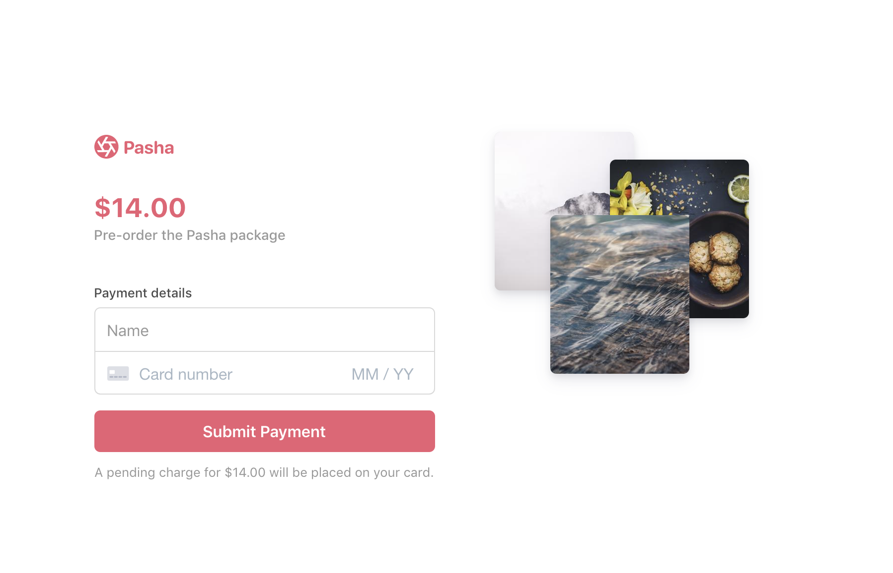

# Placing a hold on a card
Charging a card consists of three steps:

**🕵️ Authentication -** Card information is sent to the card issuer for verfication. Some cards may require the cardholder to strongly authenticate the purchase through protocols like [3D Secure](https://stripe.com/ie/guides/3d-secure-2). 

**💁 Authorization -** Funds from the customer's account are put on hold but not transferred to the merchant. 

**💸 Capture -** Funds are transferred to the merchant's account and the payment is complete.

The new Stripe Payment Intents API abstracts away these three stages by handling all steps of the process through the [confirm method](https://stripe.com/docs/api/payment_intents/confirm). If you want to split the authorization + capture steps to place a hold on a customer's card and capture later after a certain event, set capture_method to manual when creating a PaymentIntent.

Note that funds must be captured within **7 days** of authorizing the card or the PaymentIntent reverts back to a status of "requires_payment_method".

See a [hosted version](https://nbzjj.sse.codesandbox.io/) of the demo in test mode or fork on [codesandbox.io](https://codesandbox.io/s/stripe-sample-placing-a-hold-nbzjj)



There are two implementations: manual and automatic confirmation. [Confirmation](https://stripe.com/docs/api/payment_intents/confirm) is how to finalize a payment on Stripe. If you are comfortable using webhooks for any post-payment logic (e.g. sending email receipts, fulfilling orders) then use [automatic confirmation](/auto-confirmation) which will confirm the payment on the client. Otherwise, use [manual confirmation](/manual-confirmation) to confirm the payment on the server and immediately run any post-payment processes.

This sample shows:
<!-- prettier-ignore -->
|     | Manual confirmation | Automatic confirmation
:--- | :---: | :---:
💳 **Collecting card and cardholder details.** Both integrations use [Stripe Elements](https://stripe.com/docs/stripe-js) to build a custom checkout form. | ✅  | ✅ |
🙅 **Handling card authentication requests and declines.** Attempts to charge a card can fail if the bank declines the purchase or requests extra authentication.  | ✅  | ✅ |
💁 **Placing a hold on a card.** By setting confirmation_method to "manual" when creating a PaymentIntent, you split the authorization and capture steps. | ✅ | ✅ |
↪️ **Using webhooks to respond to a hold being placed on the card.** Automatic confirmation confirms the payment on the client and requires using webhooks for any follow up actions, like capturing the funds. | ❌ | ✅ |
💰 **Tracking multiple payment attempts in a PaymentIntent.** Automatic confirmation lets you use a PaymentIntent for multiple payment attempts to track the customer's payment session in one object. | ❌ | ✅ |


## How to run locally
This sample includes 5 server implementations in Node, Ruby, Python, Java, and PHP for two integration types: [manual](/manual-confirmation) and [automatic](/auto-confirmation) confirmation. 

If you want to run the sample locally, go into the directory of the integration you want to use and copy the .env.example file to your own .env file in the integration you want to try: 

```
cd manual-confirmation 
cp .env.example .env
```

Then follow the instructions in the server directory to run.

You will need a Stripe account with its own set of [API keys](https://stripe.com/docs/development#api-keys).


## FAQ
Q: Why did you pick these frameworks?

A: We chose the most minimal framework to convey the key Stripe calls and concepts you need to understand. These demos are meant as an educational tool that helps you roadmap how to integrate Stripe within your own system independent of the framework.

Q: Can you show me how to build X?

A: We are always looking for new sample ideas, please email tbd@stripe.com with your suggestion!

## Author(s)
[@adreyfus-stripe](https://twitter.com/adrind)
